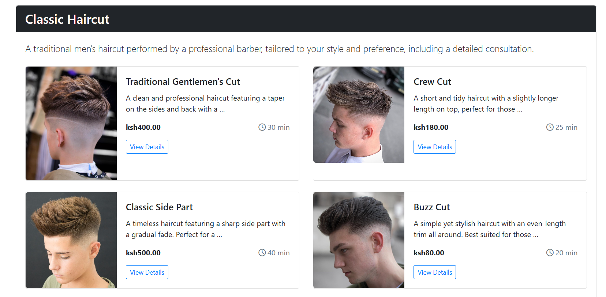
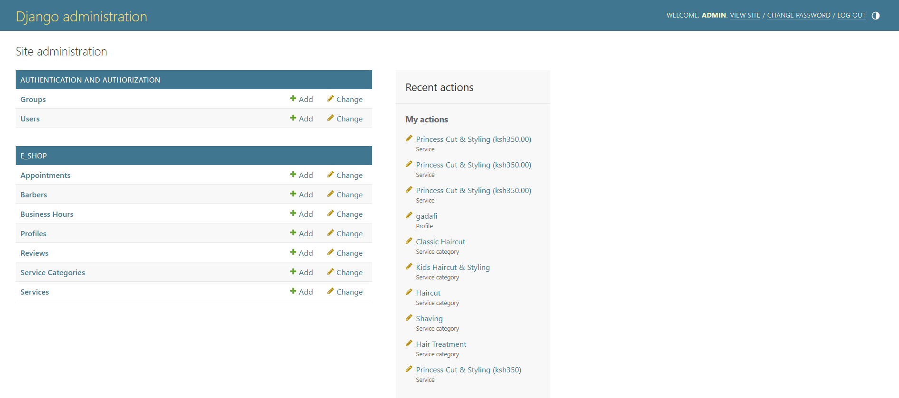
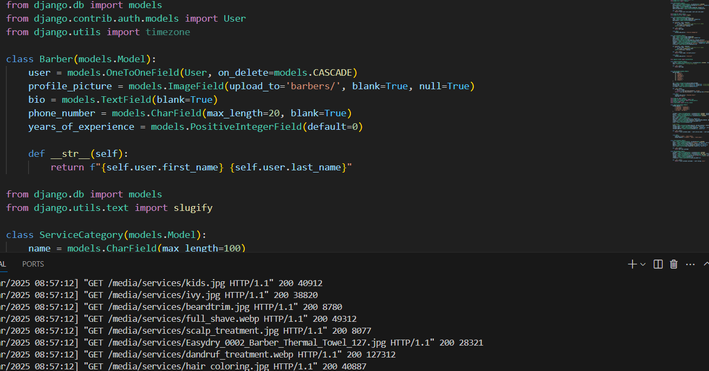
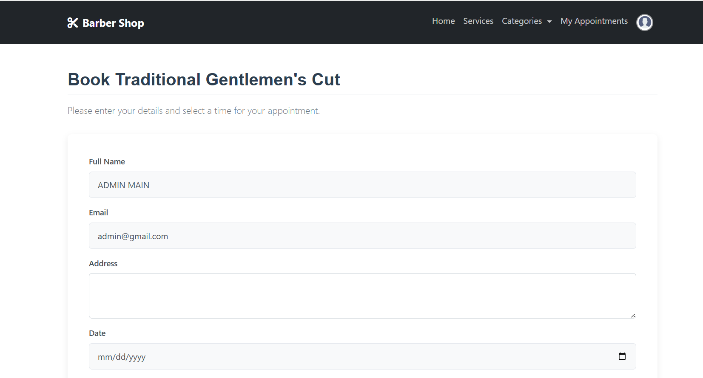

# Barber Shop Management System



A comprehensive web application for barber shop management built with Django. This system helps barber shops manage services, appointments, and customer relations efficiently.

## Features

- **User Management**: Authentication system for customers, barbers, and administrators
- **Barber Profiles**: Detailed profiles with experience, bio, and contact information
- **Service Management**: Categorized services with detailed descriptions and pricing
- **Appointment Scheduling**: Online booking system with availability checks
- **Business Hours Configuration**: Set and manage operating hours
- **Reviews & Ratings**: Customer feedback system for barbers and services
- **Customer Profiles**: User profiles with contact details and appointment history

## Screenshots

<div align="center">
  
  
</div>

<div align="center">
  
</div>

## Models Overview

### User Management
- **User**: Django's built-in user model for authentication
- **Profile**: Extended user profile with additional contact information
- **Barber**: Professional profiles with experience and specialization details

### Service Management
- **ServiceCategory**: Groups services into logical categories
- **Service**: Individual services with pricing, duration, and descriptions
- **SubService**: Component services using rich text formatting

### Scheduling System
- **BusinessHours**: Operating hours configuration for each day of the week
- **Appointment**: Customer bookings with status tracking and service details

### Feedback System
- **Review**: Customer ratings and comments for barbers and services

## Installation

1. Clone the repository:
   ```
   git clone https://github.com/yourusername/barber-shop.git
   cd barber-shop
   ```

2. Create a virtual environment:
   ```
   python -m venv venv
   source venv/bin/activate  # On Windows: venv\Scripts\activate
   ```

3. Install dependencies:
   ```
   pip install -r requirements.txt
   ```

4. Configure the database:
   ```
   python manage.py migrate
   ```

5. Create a superuser:
   ```
   python manage.py createsuperuser
   ```

6. Run the development server:
   ```
   python manage.py runserver
   ```

## Requirements

- Python 3.8+
- Django 3.2+
- Pillow (for image handling)
- django-ckeditor (for rich text fields)

## Database Schema


### Barber
- One-to-one relationship with User
- Profile picture, bio, contact details, experience level

### ServiceCategory
- Name, slug, description
- Auto-generates slugs from category names

### Service
- Name, slug, description, price, duration
- Foreign key to ServiceCategory
- Optional service image
- Active status flag

### SubService
- Rich text description of service components
- Foreign key to Service

### BusinessHours
- Day of week, opening time, closing time
- Closed day flag

### Appointment
- Customer and barber references
- Service reference
- Date and time details
- Status tracking (scheduled, completed, cancelled, no-show)
- Payment and customer details

### Profile
- Extended user information
- Contact details and address

### Review
- Customer and barber references
- Service reference
- Rating (1-5) and comments
- Creation timestamp

## Configuration

### Media Files
Configure your settings.py to properly handle media files:

```python
MEDIA_URL = '/media/'
MEDIA_ROOT = os.path.join(BASE_DIR, 'media')
```

### CKEditor
Add CKEditor to your INSTALLED_APPS and configure as needed:

```python
INSTALLED_APPS = [
    # ...
    'ckeditor',
    # ...
]

CKEDITOR_CONFIGS = {
    'default': {
        'toolbar': 'full',
        'height': 300,
        'width': 700,
    },
}
```

## Usage

### Admin Panel
Access the admin panel at `/admin/` to manage all aspects of the barber shop:
- Create and manage barber profiles
- Configure services and categories
- Set business hours
- View and manage appointments
- Monitor customer reviews


### Customer Portal
Customer-facing features:
- Browse services and pricing
- View barber profiles and availability
- Schedule appointments
- Leave reviews and feedback
- Track appointment history


## Development

### Adding New Features
Follow Django's app structure to add new functionality. Create appropriate models, views, and templates for each feature.

### Customizing Templates
The frontend can be customized by modifying templates in the templates directory.

## Directory Structure

```
barber-shop/
├── docs/
│   └── images/           # Screenshots and images for documentation
├── e_shop/               # Main application directory
│   ├── migrations/       # Database migrations
│   ├── static/           # Static files (CSS, JS, images)
│   ├── templates/        # HTML templates
│   ├── admin.py          # Admin configuration
│   ├── models.py         # Database models
│   ├── views.py          # View functions
│   ├── urls.py           # URL configurations
│   └── forms.py          # Form definitions
├── media/                # User-uploaded content
├── barber_shop/          # Project settings directory
│   ├── settings.py       # Project settings
│   ├── urls.py           # Project URL configuration
│   └── wsgi.py           # WSGI configuration
├── manage.py             # Django management script
├── requirements.txt      # Project dependencies
└── README.md             # Project documentation
```

## License


N/A

## Contributors

Steve Ongera